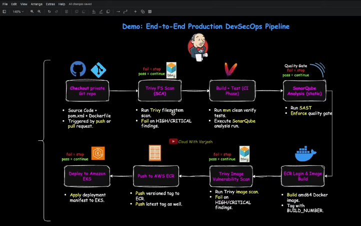
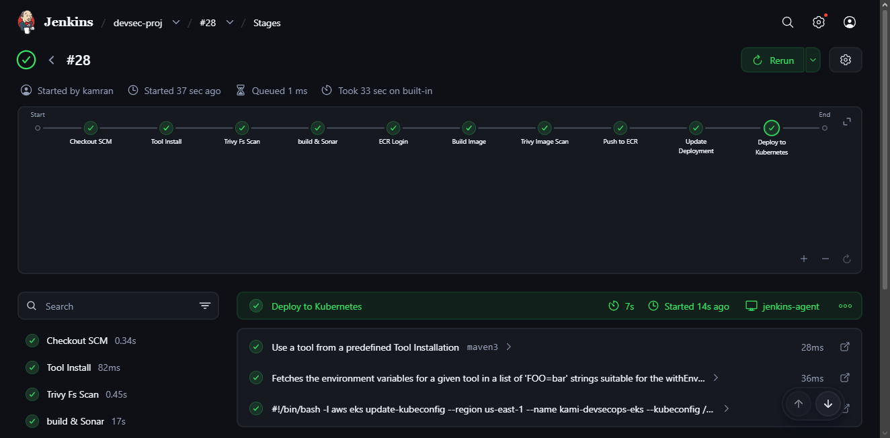
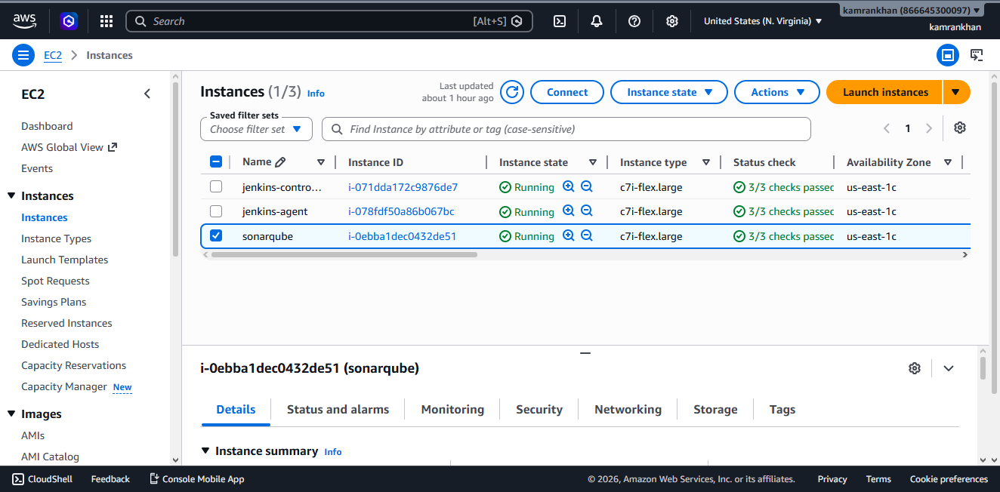
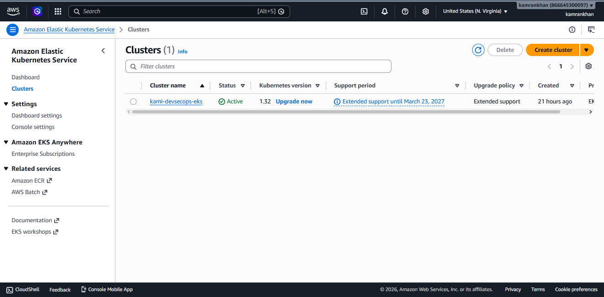
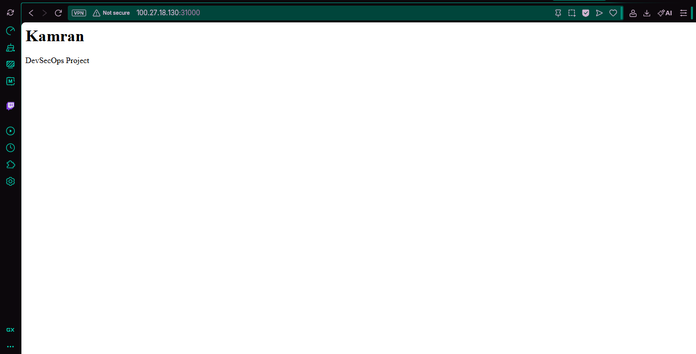
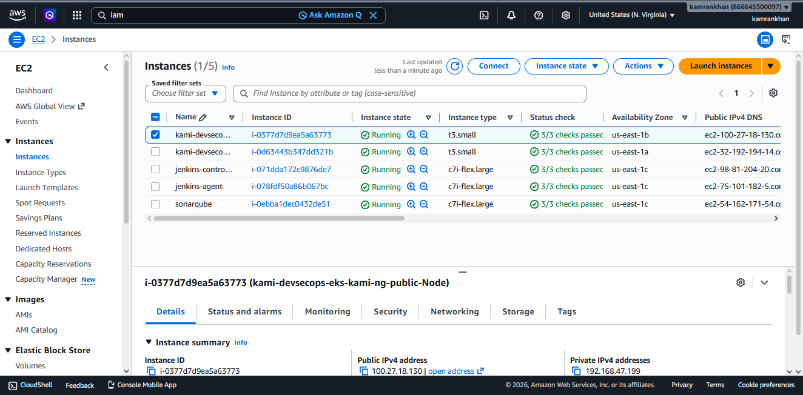

# Production DevSecOps CI/CD Pipeline | Multi-AZ Amazon EKS + Jenkins + Trivy + SonarQube + ECR + GitHub

---

## Table of Contents

* [Introduction](#introduction)
* [Lab: Install Jenkins Controller on EC2](#lab-install-jenkins-controller-on-ec2)
  * [1. Create the EC2 Instance](#1-create-the-ec2-instance)
  * [2. Connect to the Instance](#2-connect-to-the-instance)
  * [3. Install Java 21](#3-install-java-21)
  * [4. Install Jenkins](#4-install-jenkins)
  * [5. Start Jenkins](#5-start-jenkins)
  * [6. Access Jenkins UI](#6-access-jenkins-ui)
* [Lab: Configure SSH-based Jenkins Agent on EC2](#lab-configure-ssh-based-jenkins-agent-on-ec2)
  * [1. Create the EC2 Instance](#1-create-the-ec2-instance-1)
  * [2. Connect to the Instance](#2-connect-to-the-instance-1)
  * [3. Install Java 21](#3-install-java-21-1)
  * [4. Create a Dedicated Jenkins User](#4-create-a-dedicated-jenkins-user)
* [Lab: Add the Jenkins Agent to the Controller](#lab-add-the-jenkins-agent-to-the-controller)
  * [1. Generate SSH Key on the Controller](#1-generate-ssh-key-on-the-controller)
  * [2. Copy the Public Key to the Agent](#2-copy-the-public-key-to-the-agent)
  * [3. Configure the Agent in Jenkins UI](#3-configure-the-agent-in-jenkins-ui)
* [Lab: Install SonarQube on EC2](#lab-install-sonarqube-on-ec2)
  * [1. Create the EC2 Instance](#1-create-the-ec2-instance-2)
  * [2. Connect to the Instance](#2-connect-to-the-instance-2)
  * [3. Install Java 21](#3-install-java-21-2)
  * [4. Install PostgreSQL](#4-install-postgresql)
  * [5. Tune Kernel Settings](#5-tune-kernel-settings)
  * [6. Create a Dedicated Sonar User](#6-create-a-dedicated-sonar-user)
  * [7. Download and Install SonarQube](#7-download-and-install-sonarqube)
  * [8. Configure SonarQube Database](#8-configure-sonarqube-database)
  * [9. Create a Systemd Service](#9-create-a-systemd-service)
  * [10. Access the SonarQube UI](#10-access-the-sonarqube-ui)
* [Demo: End-to-End Production DevSecOps Pipeline](#demo-end-to-end-production-devsecops-pipeline)
  * [Stage 1: Git Checkout and Jenkins Job Setup](#stage-1-git-checkout-and-jenkins-job-setup)
  * [Stage 2: Trivy FS Scan](#stage-2-trivy-fs-scan)
  * [Stage 3: Build and Sonar](#stage-3-build-and-sonar)
  * [Stage 4: ECR Login](#stage-4-ecr-login)
  * [Stage 5: Build Image](#stage-5-build-image)
  * [Stage 6: Trivy Image Scan](#stage-6-trivy-image-scan)
  * [Stage 7: Push to ECR](#stage-7-push-to-ecr)
  * [Stage 8: Kubernetes Manifests](#stage-8-kubernetes-manifests)
  * [Stage 9: Deploy to Kubernetes](#stage-9-deploy-to-kubernetes)

---

# Introduction

This project builds a production-grade DevSecOps pipeline from scratch. Every commit triggers a full pipeline that scans source code, builds and scans a container image, pushes it to Amazon ECR, and deploys it to an Amazon EKS cluster — with security gates at every stage that stop the pipeline the moment something fails.



The stack covers:

* Jenkins (controller + agent, SSH-based)
* SonarQube for SAST and quality gate enforcement
* Trivy for filesystem and container image vulnerability scanning
* Docker for building the application image
* Amazon ECR for immutable image storage
* Amazon EKS with topology-aware deployments
* IAM roles and Kubernetes RBAC for least-privilege access

**Flow:** Git push → Trivy FS Scan → Maven Build + SonarQube → ECR Login → Docker Build → Trivy Image Scan → Push to ECR → Update Manifest → Deploy to EKS

---

# Lab: Install Jenkins Controller on EC2

This VM will act **only as the controller**. All pipeline workloads run on the SSH-based agent. Mixing controller and build workloads on the same machine causes resource contention and makes the setup harder to scale.

---

## 1. Create the EC2 Instance

* **AMI:** Ubuntu 24.04 LTS
* **Instance type:** c7i-flex.large
* **Root volume:** 20 GB or more

**Security Group (jenkins-controller):**

* Allow SSH (22) from your IP
* Allow TCP (8080) from your IP — this is the Jenkins UI port

---

## 2. Connect to the Instance

```bash
ssh -i <your-key>.pem ubuntu@<jenkins-controller-public-ip>
```

Secure your SSH key:

```bash
chmod 600 ~/.ssh/<your-key>.pem
```

Set a recognisable hostname so you always know which server you are on:

```bash
sudo hostnamectl set-hostname jenkins-controller
exec bash
```

---

## 3. Install Java 21

Jenkins LTS requires Java 21.

```bash
sudo apt update
sudo apt install -y openjdk-21-jdk
java -version
```

---

## 4. Install Jenkins

Add the Jenkins repository and install:

```bash
curl -fsSL https://pkg.jenkins.io/debian-stable/jenkins.io-2023.key | \
  sudo tee /usr/share/keyrings/jenkins-keyring.asc > /dev/null

echo deb [signed-by=/usr/share/keyrings/jenkins-keyring.asc] \
  https://pkg.jenkins.io/debian-stable binary/ | \
  sudo tee /etc/apt/sources.list.d/jenkins.list > /dev/null

sudo apt update
sudo apt install -y jenkins
```

---

## 5. Start Jenkins

```bash
sudo systemctl daemon-reload
sudo systemctl enable jenkins
sudo systemctl start jenkins
sudo systemctl status jenkins
```

---

## 6. Access Jenkins UI

Open in your browser:

```
http://<jenkins-controller-public-ip>:8080
```

Get the initial admin password:

```bash
sudo cat /var/lib/jenkins/secrets/initialAdminPassword
```

Paste it into the browser, install suggested plugins, create your admin user, and log in.

---

# Lab: Configure SSH-based Jenkins Agent on EC2

This VM runs all pipeline jobs. The controller connects to it over SSH.

---

## 1. Create the EC2 Instance

* **AMI:** Ubuntu 24.04 LTS
* **Instance type:** c7i-flex.large
* **Root volume:** 30 GB or more (Trivy downloads ~900 MB vulnerability databases during image scans)

**Security Group (jenkins-agent):**

* Allow SSH (22) from the controller's private IP only
* Do not expose port 8080 — the agent does not run a Jenkins UI

---

## 2. Connect to the Instance

```bash
ssh -i <your-key>.pem ubuntu@<jenkins-agent-public-ip>
```

Set hostname:

```bash
sudo hostnamectl set-hostname jenkins-agent
exec bash
```

---

## 3. Install Java 21

The Jenkins agent process requires Java to run.

```bash
sudo apt update
sudo apt install -y openjdk-21-jdk
java -version
```

---

## 4. Create a Dedicated Jenkins User

All pipeline jobs run as the `jenkins` user. Creating a dedicated non-root user limits what a compromised build can do on the host.

```bash
sudo useradd -m -s /bin/bash jenkins
```

---

# Lab: Add the Jenkins Agent to the Controller

The controller authenticates to the agent over SSH using a key pair generated inside the Jenkins user's home directory.

SSH into the controller:

```bash
ssh -i <your-key>.pem ubuntu@<jenkins-controller-public-ip>
```

---

## 1. Generate SSH Key on the Controller

Jenkins runs as the `jenkins` user, so generate the key inside its home directory.

```bash
sudo su - jenkins
ssh-keygen -t ed25519 -f /var/lib/jenkins/.ssh/jenkins-agent-key -C "jenkins-agent-access"
```

Show the public key so you can copy it:

```bash
cat /var/lib/jenkins/.ssh/jenkins-agent-key.pub
```

---

## 2. Copy the Public Key to the Agent

You need two SSH sessions open — one to the controller and one to the agent.

**On the agent**, switch to the jenkins user and add the public key:

```bash
sudo su - jenkins
mkdir -p ~/.ssh
vim ~/.ssh/authorized_keys
```

Paste the public key (the single line starting with `ssh-ed25519`) inside, save and exit.

Set the correct permissions:

```bash
chmod 700 ~/.ssh
chmod 600 ~/.ssh/authorized_keys
```

**Test the connection from the controller** (run as the jenkins user so the key path resolves correctly):

```bash
sudo su - jenkins
ssh -i /var/lib/jenkins/.ssh/jenkins-agent-key jenkins@<jenkins-agent-private-ip> hostname
```

Expected output: `jenkins-agent`

> Running the test as `jenkins` matters. If you run it as `ubuntu`, the path `~/.ssh/jenkins-agent-key` expands to `/home/ubuntu/.ssh/jenkins-agent-key` which does not exist, and the connection will fail.

Populate the known_hosts file so Jenkins can connect automatically without an interactive prompt:

```bash
ssh-keyscan <jenkins-agent-private-ip> | sudo -u jenkins tee -a /var/lib/jenkins/.ssh/known_hosts > /dev/null
```

---

## 3. Configure the Agent in Jenkins UI

1. Go to **Jenkins Dashboard → Manage Jenkins → Nodes → New Node**
2. Name: `jenkins-agent`, Type: **Permanent Agent**
3. Configure the following fields:
   * **Number of executors:** 1
   * **Remote root directory:** `/home/jenkins`
   * **Labels:** `deocker-maven` (this is what the Jenkinsfile references in `agent { label '...' }`)
   * **Usage:** Use this node as much as possible
   * **Launch method:** Launch agents via SSH
4. Under **Host**, enter the agent's **private IP**
5. Under **Credentials**, click Add → **SSH Username with private key**
   * Username: `jenkins`
   * Private key: paste the contents of `/var/lib/jenkins/.ssh/jenkins-agent-key` from the controller
   * Passphrase: leave empty
6. **Host Key Verification Strategy:** select **Known hosts file Verification Strategy** — Jenkins uses its internal `known_hosts` file which we already populated
7. Click **Save**, then **Launch agent**

Expected result: `Agent successfully connected and online`

---

# Lab: Install SonarQube on EC2

SonarQube and PostgreSQL run on the same VM. This is a common small-team and training setup.

---

## 1. Create the EC2 Instance

* **AMI:** Ubuntu 22.04 LTS
* **Instance type:** c7i-flex.large
* **Root volume:** 20 GB or more

**Security Group (sonarqube):**

* Allow SSH (22) from your IP
* Allow TCP (9000) from your IP and from the Jenkins agent's IP

---

## 2. Connect to the Instance

```bash
ssh -i <your-key>.pem ubuntu@<sonarqube-public-ip>
```

Set hostname:

```bash
sudo hostnamectl set-hostname sonarqube
exec bash
```

---

## 3. Install Java 21

SonarQube 25.x requires Java 21.

```bash
sudo apt-get update
sudo apt-get install -y openjdk-21-jre
java -version
```

---

## 4. Install PostgreSQL

SonarQube needs a relational database to store analysis results, quality gate history, user accounts, and configuration.

```bash
sudo apt install -y postgresql postgresql-contrib
sudo systemctl enable postgresql
sudo systemctl start postgresql
```

Create the database and user:

```bash
sudo -u postgres psql
```

Inside psql, run:

```sql
CREATE ROLE sonar WITH LOGIN ENCRYPTED PASSWORD 'StrongPasswordHere';
CREATE DATABASE sonarqube OWNER sonar;
GRANT ALL PRIVILEGES ON DATABASE sonarqube TO sonar;
\q
```

Verify the setup:

```bash
sudo -u postgres psql -c "\du"
sudo -u postgres psql -c "\l"
```

---

## 5. Tune Kernel Settings

SonarQube uses Elasticsearch internally, which requires higher kernel limits than the Ubuntu defaults.

```bash
echo 'vm.max_map_count=524288' | sudo tee -a /etc/sysctl.d/99-sonarqube.conf
echo 'fs.file-max=131072' | sudo tee -a /etc/sysctl.d/99-sonarqube.conf
sudo sysctl --system
```

Set ulimits for the sonar user:

```bash
echo 'sonar   -   nofile   131072' | sudo tee /etc/security/limits.d/99-sonarqube.conf
echo 'sonar   -   nproc    8192'   | sudo tee -a /etc/security/limits.d/99-sonarqube.conf
```

> Apply these before starting SonarQube. Skipping them causes Elasticsearch to fail at startup with resource limit errors.

---

## 6. Create a Dedicated Sonar User

```bash
sudo useradd -m -d /opt/sonarqube -s /bin/bash sonar
```

---

## 7. Download and Install SonarQube

```bash
cd /tmp
curl -L -o sonarqube.zip "https://binaries.sonarsource.com/Distribution/sonarqube/sonarqube-25.11.0.114957.zip"
sudo apt-get install -y unzip
unzip sonarqube.zip
sudo mv sonarqube-25.11.0.114957 /opt/sonarqube-current
sudo chown -R sonar:sonar /opt/sonarqube-current
```

---

## 8. Configure SonarQube Database

Edit the SonarQube configuration file as the sonar user:

```bash
sudo -u sonar vim /opt/sonarqube-current/conf/sonar.properties
```

Uncomment and set these three lines:

```properties
sonar.jdbc.username=sonar
sonar.jdbc.password=StrongPasswordHere
sonar.jdbc.url=jdbc:postgresql://localhost:5432/sonarqube
```

> PostgreSQL listens on port 5432 by default. The JDBC URL format is `jdbc:postgresql://<host>:<port>/<database>` — do not use the MS SQL Server format (`sqlserver://`) or the connection will fail with an invalid port error.

---

## 9. Create a Systemd Service

Create the unit file:

```bash
sudo vim /etc/systemd/system/sonarqube.service
```

Paste this content:

```ini
[Unit]
Description=SonarQube service
After=network.target postgresql.service

[Service]
Type=forking
User=sonar
Group=sonar
ExecStart=/opt/sonarqube-current/bin/linux-x86-64/sonar.sh start
ExecStop=/opt/sonarqube-current/bin/linux-x86-64/sonar.sh stop
Restart=on-failure
LimitNOFILE=131072
LimitNPROC=8192

[Install]
WantedBy=multi-user.target
```

Enable and start:

```bash
sudo systemctl daemon-reload
sudo systemctl enable sonarqube
sudo systemctl start sonarqube
sudo systemctl status sonarqube
```

If the status is not `active (running)`, check the logs:

```bash
sudo tail -n 200 /opt/sonarqube-current/logs/sonar.log
sudo tail -n 200 /opt/sonarqube-current/logs/web.log
sudo tail -n 200 /opt/sonarqube-current/logs/es.log
```

---

## 10. Access the SonarQube UI

Open in browser:

```
http://<sonarqube-public-ip>:9000
```

Default login: `admin / admin`. You will be prompted to change the password on first login.

From here you can explore Quality Profiles, Quality Gates, and Rules. Later you will create a project and a token that Jenkins will use during the pipeline.

---

# Demo: End-to-End Production DevSecOps Pipeline

This is what we are building:



The full infrastructure at this point:



---

## Stage 1: Git Checkout and Jenkins Job Setup

### 1. Create a Private GitHub Repository

Go to **GitHub → New Repository**, name it and set visibility to **Private**. This repo holds the application code, `pom.xml`, `Dockerfile`, `Jenkinsfile`, and Kubernetes manifests.

### 2. Create a GitHub Personal Access Token (PAT)

Go to **GitHub → Settings → Developer settings → Personal access tokens → Classic PAT**.

Create a token with the `repo` scope. Copy it immediately — GitHub will not show it again.

### 3. Add the PAT to Jenkins Credentials

Go to **Manage Jenkins → Credentials → System → Global → Add Credentials**.

* Kind: **Username with password**
* Username: your GitHub username
* Password: your PAT
* ID: `github-pat`

### 4. Push Your Code to the Private Repo

From your local project folder:

```bash
git init
git add .
git commit -m "initial commit"
git branch -M main
git remote add private-repo https://github.com/<your-username>/<your-repo>.git
git remote set-url private-repo https://<TOKEN>@github.com/<your-username>/<your-repo>.git
git push private-repo main
```

Remove the token from the remote URL immediately after pushing:

```bash
git remote set-url private-repo https://github.com/<your-username>/<your-repo>.git
```

### 5. Create the Jenkins Pipeline Job

Go to **Jenkins → New Item → Pipeline**.

* Name: `devsec-proj`
* Definition: **Pipeline script from SCM**
* SCM: **Git**
* Repository URL: `https://github.com/<your-username>/<your-repo>.git`
* Credentials: `github-pat`
* Branch: `*/main`
* Script Path: `Jenkinsfile`

Click **Save**, then **Build Now** to verify the checkout works.

---

## Stage 2: Trivy FS Scan

### What this stage does

Before anything is compiled or built, Trivy scans the entire workspace at the filesystem level. It catches vulnerable dependencies declared in `pom.xml`, hardcoded secrets, and misconfigured files — all before a single line is compiled.

This is different from what SonarQube does. Trivy finds third-party dependency CVEs and known secret patterns. SonarQube analyses your own code logic. You need both.

### Install Trivy on the Jenkins Agent

SSH into the agent and install Trivy:

```bash
curl -sfL https://raw.githubusercontent.com/aquasecurity/trivy/main/contrib/install.sh | \
  sudo sh -s -- -b /usr/local/bin

trivy --version
```

Create a dedicated temp directory for Trivy's vulnerability database downloads. The default `/tmp` is a tmpfs mount (around 1.9 GB) which fills up during the ~900 MB Java database download and causes the scan to fail mid-run. This directory on the main disk avoids that.

```bash
sudo mkdir -p /opt/trivy-tmp
sudo chown jenkins:jenkins /opt/trivy-tmp
```

### Jenkinsfile — Stage 2

```groovy
pipeline {
  agent { label 'deocker-maven' }
  environment {
    TMPDIR = '/opt/trivy-tmp'
  }
  stages {
    stage('Trivy Fs Scan') {
      steps {
        sh 'trivy fs --exit-code 1 --severity HIGH,CRITICAL .'
      }
    }
  }
}
```

`--exit-code 1` is what makes this a real gate. If Trivy finds anything HIGH or CRITICAL it returns exit code 1 and Jenkins fails the build. The pipeline stops there.

### Commit and push

```bash
git add .
git commit -m "add Jenkinsfile with Trivy FS scan"
git push private-repo main
```

Click **Build Now**. A clean scan looks like this:

```
Report Summary
┌─────────┬──────┬─────────────────┬─────────┐
│ Target  │ Type │ Vulnerabilities │ Secrets │
├─────────┼──────┼─────────────────┼─────────┤
│ pom.xml │ pom  │        0        │    -    │
└─────────┴──────┴─────────────────┴─────────┘
```

---

## Stage 3: Build and Sonar

### What this stage does

Maven compiles the project, runs unit tests, generates JaCoCo coverage reports, and uploads everything to SonarQube in a single command. The pipeline waits for SonarQube to evaluate the quality gate and fails the build if the gate is not passed.

### 1. Create a SonarQube Project

In the SonarQube UI, go to **Projects → Create Project**.

* Project display name: `kami-devsec-proj`
* Project key: `kami-decsec-proj`

### 2. Create a Quality Gate

Go to **Quality Gates → Create**.

* Name: `kami-devsec-qg`
* Add Condition → Coverage → On: Overall Code → Operator: is greater than → Value: `1`

Assign the project to this gate.

### 3. Generate a SonarQube Token

Go to **Administration → Security → Users → your user → Generate Token**.

Name it `jenkins-token`. Copy it immediately.

### 4. Add the Token to Jenkins

Go to **Manage Jenkins → Credentials → System → Global → Add Credentials**.

* Kind: **Secret Text**
* Secret: `<your-sonarqube-token>`
* ID: `sonarqube-token`

### 5. Add Maven Tool in Jenkins

Go to **Manage Jenkins → Global Tool Configuration → Maven**.

* Name: `maven3`
* Check **Install automatically**

### Jenkinsfile — Stage 3 added

```groovy
pipeline {
  agent { label 'deocker-maven' }
  tools {
    maven 'maven3'
  }
  environment {
    SONAR_IP = '172.31.23.2'
    TMPDIR   = '/opt/trivy-tmp'
  }
  stages {
    stage('Trivy Fs Scan') {
      steps {
        sh 'trivy fs --exit-code 1 --severity HIGH,CRITICAL .'
      }
    }
    stage('build & Sonar') {
      steps {
        withCredentials([string(credentialsId: 'sonarqube-token', variable: 'SONAR_TOKEN')]) {
          sh 'mvn clean verify sonar:sonar \
            -Dsonar.projectKey=kami-decsec-proj \
            -Dsonar.host.url="http://${SONAR_IP}:9000" \
            -Dsonar.token="${SONAR_TOKEN}" \
            -Dsonar.qualitygate.wait=true'
        }
      }
    }
  }
}
```

`-Dsonar.qualitygate.wait=true` makes Jenkins wait for SonarQube to finish processing the analysis report before deciding pass or fail. Without it the build would complete before the quality gate is evaluated.

<!-- Add SonarQube quality gate screenshot here -->

---

## Stage 4: ECR Login

### What this stage does

The Jenkins agent authenticates to Amazon ECR using the IAM role attached to its EC2 instance. No long-lived AWS access keys are stored anywhere.

### 1. Install AWS CLI on the Agent

SSH into the agent:

```bash
curl "https://awscli.amazonaws.com/awscli-exe-linux-x86_64.zip" -o awscliv2.zip
sudo apt install -y unzip
unzip awscliv2.zip
sudo ./aws/install
aws --version
```

Verify both the system user and the jenkins user can run it:

```bash
sudo -u jenkins aws --version
```

### 2. Install Docker on the Agent

```bash
sudo apt remove docker docker-engine docker.io containerd runc -y
sudo apt update
sudo apt install -y ca-certificates curl gnupg
sudo install -m 0755 -d /etc/apt/keyrings
curl -fsSL https://download.docker.com/linux/ubuntu/gpg | \
  sudo gpg --dearmor -o /etc/apt/keyrings/docker.gpg
sudo chmod a+r /etc/apt/keyrings/docker.gpg
echo "deb [arch=$(dpkg --print-architecture) signed-by=/etc/apt/keyrings/docker.gpg] \
  https://download.docker.com/linux/ubuntu \
  $(. /etc/os-release && echo "$VERSION_CODENAME") stable" | \
  sudo tee /etc/apt/sources.list.d/docker.list > /dev/null
sudo apt update
sudo apt install -y docker-ce docker-ce-cli containerd.io docker-buildx-plugin
```

Add the jenkins user to the docker group so builds can run Docker without sudo:

```bash
sudo usermod -aG docker jenkins
```

> After adding jenkins to the docker group, restart the Jenkins agent connection from the Jenkins UI so the group membership takes effect.

### 3. Create an IAM Role for the Jenkins Agent

In the AWS Console, go to **IAM → Roles → Create Role**.

* Use case: **EC2**
* Attach policy: `AmazonEC2ContainerRegistryPowerUser`
* Name: `jenkins-agent-role`

Attach the role to the agent EC2: **EC2 → Instances → jenkins-agent → Actions → Security → Modify IAM Role**, select `jenkins-agent-role`.

### 4. Create the ECR Repository

Go to **Amazon ECR → Private Registry → Create Repository**.

* Name: `kami-devsec-proj`
* Image tag mutability: **Immutable**

Immutable tags prevent accidental overwrites and give you a full audit trail of every image pushed.

### Jenkinsfile — Stage 4 added

```groovy
environment {
  SONAR_IP     = '172.31.23.2'
  ECR_REGISTRY = '866645300097.dkr.ecr.us-east-1.amazonaws.com'
  IMAGE_REPO   = "${ECR_REGISTRY}/kami-devsec-proj"
  TMPDIR       = '/opt/trivy-tmp'
}
...
stage('ECR Login') {
  steps {
    sh 'aws ecr get-login-password --region us-east-1 | docker login --username AWS --password-stdin $ECR_REGISTRY'
  }
}
```

`aws ecr get-login-password` fetches a short-lived token and pipes it directly into Docker. This works without any hardcoded keys because the EC2 instance has the `jenkins-agent-role` IAM role attached.

---

## Stage 5: Build Image

### Create the Dockerfile

Add a `Dockerfile` to your project root. We use `eclipse-temurin:21-jre-alpine` as the base image. The Alpine variant was chosen specifically because the full Ubuntu-based Temurin image ships with `pebble` (a Canonical process manager) which carries unresolvable Go stdlib CVEs. Switching to Alpine eliminates that entirely and also reduces the image size significantly.

```dockerfile
FROM eclipse-temurin:21-jre-alpine
WORKDIR /app
COPY target/devsecops-proj-1.0.0-SNAPSHOT.jar app.jar
EXPOSE 8080
ENTRYPOINT ["java", "-jar", "app.jar"]
```

Commit and push:

```bash
git add .
git commit -m "add Dockerfile"
git push private-repo main
```

### Jenkinsfile — Stage 5 added

```groovy
stage('Build Image') {
  steps {
    sh 'export DOCKER_BUILDKIT=0 && docker build --platform linux/amd64 -t "$IMAGE_REPO:$BUILD_NUMBER" .'
  }
}
```

`--platform linux/amd64` ensures the image is built for the same architecture as the EKS worker nodes. `$BUILD_NUMBER` gives every build a unique, immutable identifier so you can always trace a running pod back to the exact pipeline run that produced it.

`DOCKER_BUILDKIT=0` disables the newer BuildKit engine to ensure predictable classic-mode builds across different Docker versions.

---

## Stage 6: Trivy Image Scan

### What this stage does

The built image is scanned before it ever touches ECR. This catches vulnerabilities that only exist at the container level — OS packages, binaries, and libraries inside the base image that are not visible in the source code.

Trivy FS (Stage 2) scans your project dependencies. Trivy Image scans the runtime artifact itself. The distinction matters: most CVEs in production come from the base image, not your application code.

### Jenkinsfile — Stage 6 added

```groovy
stage('Trivy Image Scan') {
  steps {
    sh '''
      TMPDIR=/opt/trivy-tmp trivy image --exit-code 1 --severity HIGH,CRITICAL "$IMAGE_REPO:$BUILD_NUMBER"
      rm -rf /opt/trivy-tmp/*
    '''
  }
}
```

A clean scan result:

```
Report Summary
┌──────────────────────────────────────────────────┬────────┬─────────────────┬─────────┐
│ Target                                           │ Type   │ Vulnerabilities │ Secrets │
├──────────────────────────────────────────────────┼────────┼─────────────────┼─────────┤
│ kami-devsec-proj:28 (alpine 3.23.4)              │ alpine │        0        │    -    │
├──────────────────────────────────────────────────┼────────┼─────────────────┼─────────┤
│ app/app.jar                                      │  jar   │        0        │    -    │
└──────────────────────────────────────────────────┴────────┴─────────────────┴─────────┘
```

---

## Stage 7: Push to ECR

Only after both Trivy scans pass does the image get pushed. The image is tagged with the build number only — no `latest` tag. With ECR immutable tags enabled, a pushed tag can never be overwritten, which means every image in ECR corresponds to exactly one pipeline run.

```groovy
stage('Push to ECR') {
  steps {
    sh 'docker push "$IMAGE_REPO:$BUILD_NUMBER"'
  }
}
```

<!-- Add ECR repository screenshot showing build-tagged images here -->

---

## Stage 8: Kubernetes Manifests

Create `deploy-svc.yaml` in the project root. The Deployment uses `topologySpreadConstraints` to ensure the two replicas land in different Availability Zones. With EKS worker nodes spread across `us-east-1a` and `us-east-1b`, this guarantees the application stays available even if one AZ has issues.

```yaml
apiVersion: apps/v1
kind: Deployment
metadata:
  name: kami-devsec-proj
  namespace: kami-devsecops
  labels:
    app: kami-devsec-proj
spec:
  replicas: 2
  selector:
    matchLabels:
      app: kami-devsec-proj
  template:
    metadata:
      labels:
        app: kami-devsec-proj
    spec:
      topologySpreadConstraints:
        - maxSkew: 1
          topologyKey: topology.kubernetes.io/zone
          whenUnsatisfiable: DoNotSchedule
          labelSelector:
            matchLabels:
              app: kami-devsec-proj
      containers:
        - name: kami-devsec-proj
          image: 866645300097.dkr.ecr.us-east-1.amazonaws.com/kami-devsec-proj:latest
          ports:
            - containerPort: 8080
---
apiVersion: v1
kind: Service
metadata:
  name: kami-devsec-proj-svc
  namespace: kami-devsecops
  labels:
    app: kami-devsec-proj
spec:
  type: NodePort
  selector:
    app: kami-devsec-proj
  ports:
    - port: 80
      targetPort: 8080
      protocol: TCP
      nodePort: 31000
```

**topologySpreadConstraints explained:**

* `maxSkew: 1` — maximum allowed difference in pod count between AZs. With 2 replicas this enforces a 1-1 split.
* `topologyKey: topology.kubernetes.io/zone` — tells the scheduler to spread across Availability Zones.
* `whenUnsatisfiable: DoNotSchedule` — if placing a pod would violate the constraint, the scheduler will not place it.

The Update Deployment stage uses `sed` to rewrite the image line with the exact build number before applying the manifest:

```groovy
stage('Update Deployment') {
  steps {
    sh 'sed -i "s|image:.*|image: $IMAGE_REPO:$BUILD_NUMBER|g" deploy-svc.yaml'
  }
}
```

The `|` delimiter avoids having to escape the forward slashes in the ECR URL. The `g` flag replaces all matches in the file, which is safe if the manifest has multiple containers.

Commit the manifest:

```bash
git add .
git commit -m "add kubernetes manifests"
git push private-repo main
```

---

## Stage 9: Deploy to Kubernetes

### 1. Create the EKS Cluster

Install `eksctl` on your local machine from [eksctl.io/installation](https://eksctl.io/installation).

Create `eks-config.yaml`:

```yaml
apiVersion: eksctl.io/v1alpha5
kind: ClusterConfig
metadata:
  name: kami-devsecops-eks
  region: us-east-1
  version: "1.32"
availabilityZones:
  - us-east-1a
  - us-east-1b
iam:
  withOIDC: true
managedNodeGroups:
  - name: kami-ng-public
    instanceType: t3.small
    minSize: 2
    maxSize: 2
    desiredCapacity: 2
    volumeSize: 20
    privateNetworking: false
    iam:
      withAddonPolicies:
        autoScaler: true
        ebs: true
```

Create the cluster:

```bash
eksctl create cluster -f eks-config.yaml
```

Verify nodes are spread across AZs:

```bash
kubectl get nodes --show-labels | grep topology.kubernetes.io/zone
```



### 2. Install kubectl on the Jenkins Agent

SSH into the agent:

```bash
curl -LO https://dl.k8s.io/release/v1.32.0/bin/linux/amd64/kubectl
chmod +x kubectl
sudo mv kubectl /usr/local/bin/
kubectl version --client
sudo -u jenkins kubectl version --client
```

### 3. Attach an EKS Policy to the Jenkins Agent Role

The agent needs permission to call `eks:DescribeCluster` to update its kubeconfig. Add an inline policy to `jenkins-agent-role` in the AWS Console:

Go to **IAM → Roles → jenkins-agent-role → Add inline policy**:

```json
{
  "Version": "2012-10-17",
  "Statement": [
    {
      "Effect": "Allow",
      "Action": ["eks:DescribeCluster"],
      "Resource": "arn:aws:eks:us-east-1:866645300097:cluster/kami-devsecops-eks"
    }
  ]
}
```

### 4. Edit aws-auth to Map the Jenkins IAM Role

The `aws-auth` ConfigMap controls which IAM roles are allowed to authenticate to the cluster. By default, eksctl only adds the node instance role. We add our Jenkins role and place it in `system:authenticated` — a group that confirms identity but grants no permissions on its own. RBAC handles what Jenkins can actually do.

From your admin machine (with cluster-admin access):

```bash
kubectl -n kube-system edit configmap aws-auth
```

Add under `mapRoles`:

```yaml
- rolearn: arn:aws:iam::866645300097:role/jenkins-agent-role
  username: jenkins-agent-role
  groups:
    - system:authenticated
```

Verify both entries are present:

```bash
kubectl describe configmap aws-auth -n kube-system
```

> We do not add Jenkins to `system:masters` (full cluster admin) or `system:nodes` (node identity). Neither is needed for a deployment pipeline and both would grant far more access than required.

### 5. Grant Precise RBAC Permissions

Create `clusterrole-binding.yaml`:

```yaml
apiVersion: rbac.authorization.k8s.io/v1
kind: ClusterRole
metadata:
  name: jenkins-deployer-role
rules:
  - apiGroups: ["apps"]
    resources: ["deployments", "replicasets"]
    verbs: ["get", "list", "watch", "create", "update", "patch", "delete"]
  - apiGroups: [""]
    resources: ["pods"]
    verbs: ["get", "list", "watch", "delete"]
  - apiGroups: [""]
    resources: ["services"]
    verbs: ["get", "list", "watch", "create", "update", "patch", "delete"]
  - apiGroups: [""]
    resources: ["namespaces"]
    verbs: ["get", "list", "watch", "create", "delete", "patch", "update"]
---
apiVersion: rbac.authorization.k8s.io/v1
kind: ClusterRoleBinding
metadata:
  name: jenkins-deployer-binding
subjects:
  - kind: User
    name: jenkins-agent-role
    apiGroup: rbac.authorization.k8s.io
roleRef:
  kind: ClusterRole
  name: jenkins-deployer-role
  apiGroup: rbac.authorization.k8s.io
```

Apply from your admin machine:

```bash
kubectl apply -f clusterrole-binding.yaml
```

### 6. Add the Deploy Stage to the Jenkinsfile

The full final Jenkinsfile:

```groovy
pipeline {
  agent { label 'deocker-maven' }
  tools {
    maven 'maven3'
  }
  environment {
    SONAR_IP         = '172.31.23.2'
    ECR_REGISTRY     = '866645300097.dkr.ecr.us-east-1.amazonaws.com'
    IMAGE_REPO       = "${ECR_REGISTRY}/kami-devsec-proj"
    TMPDIR           = '/opt/trivy-tmp'
    EKS_CLUSTER_NAME = 'kami-devsecops-eks'
    AWS_REGION       = 'us-east-1'
  }
  stages {
    stage('Trivy Fs Scan') {
      steps {
        sh 'trivy fs --exit-code 1 --severity HIGH,CRITICAL .'
      }
    }
    stage('build & Sonar') {
      steps {
        withCredentials([string(credentialsId: 'sonarqube-token', variable: 'SONAR_TOKEN')]) {
          sh 'mvn clean verify sonar:sonar \
            -Dsonar.projectKey=kami-decsec-proj \
            -Dsonar.host.url="http://${SONAR_IP}:9000" \
            -Dsonar.token="${SONAR_TOKEN}" \
            -Dsonar.qualitygate.wait=true'
        }
      }
    }
    stage('ECR Login') {
      steps {
        sh 'aws ecr get-login-password --region $AWS_REGION | docker login --username AWS --password-stdin $ECR_REGISTRY'
      }
    }
    stage('Build Image') {
      steps {
        sh 'export DOCKER_BUILDKIT=0 && docker build --platform linux/amd64 -t "$IMAGE_REPO:$BUILD_NUMBER" .'
      }
    }
    stage('Trivy Image Scan') {
      steps {
        sh '''
          TMPDIR=/opt/trivy-tmp trivy image --exit-code 1 --severity HIGH,CRITICAL "$IMAGE_REPO:$BUILD_NUMBER"
          rm -rf /opt/trivy-tmp/*
        '''
      }
    }
    stage('Push to ECR') {
      steps {
        sh 'docker push "$IMAGE_REPO:$BUILD_NUMBER"'
      }
    }
    stage('Update Deployment') {
      steps {
        sh 'sed -i "s|image:.*|image: $IMAGE_REPO:$BUILD_NUMBER|g" deploy-svc.yaml'
      }
    }
    stage('Deploy to Kubernetes') {
      steps {
        sh '''#!/bin/bash -l
          aws eks update-kubeconfig \
            --region $AWS_REGION \
            --name $EKS_CLUSTER_NAME \
            --kubeconfig /home/jenkins/.kube/config

          kubectl create ns kami-devsecops --dry-run=client -o yaml | kubectl apply -f -
          kubectl apply -f deploy-svc.yaml

          kubectl rollout status -n kami-devsecops deployment/kami-devsec-proj --timeout=60s || {
            kubectl rollout undo -n kami-devsecops deployment/kami-devsec-proj || true
            exit 1
          }
        '''
      }
    }
  }
}
```

`--dry-run=client -o yaml | kubectl apply -f -` for the namespace is idempotent — it will not fail if the namespace already exists, unlike a bare `kubectl create ns` which errors on re-runs.

The rollout status check waits up to 60 seconds for the deployment to become healthy. If it times out, it triggers an automatic rollback and fails the stage so you always know something went wrong.

### 7. Commit, Push, and Run

```bash
git add .
git commit -m "complete pipeline with EKS deploy"
git push private-repo main
```

Click **Build Now** in Jenkins. All nine stages should go green.

After a successful run, the application is accessible at:

```
http://<node-public-ip>:31000
```





---

# References

**Jenkins**
* Declarative Pipeline Syntax: https://www.jenkins.io/doc/book/pipeline/syntax/

**SonarQube**
* Scanner for Maven: https://docs.sonarsource.com/sonarqube
* Quality Gates: https://docs.sonarsource.com/sonarqube/latest/user-guide/quality-gates/

**Trivy**
* Official Documentation: https://trivy.dev

**Amazon ECR**
* Authentication: https://docs.aws.amazon.com/AmazonECR/latest/userguide/ECR_Authorization.html

**Amazon EKS**
* aws-auth ConfigMap: https://docs.aws.amazon.com/eks/latest/userguide/add-user-role.html
* eksctl cluster creation: https://eksctl.io/usage/creating-and-managing-clusters/

**Kubernetes**
* Topology Spread Constraints: https://kubernetes.io/docs/concepts/workloads/pods/pod-topology-spread-constraints/
* RBAC Authorization: https://kubernetes.io/docs/reference/access-authn-authz/rbac/
